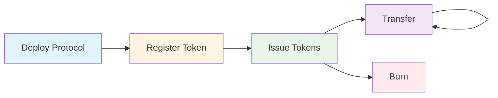
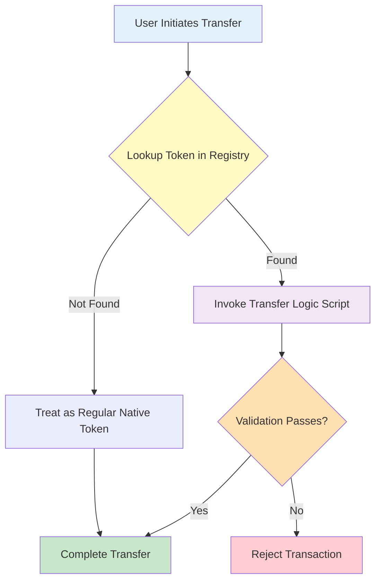

# CIP-113 Programmable Tokens — Aiken Implementation


**Smart contracts for CIP-113 programmable tokens on Cardano, written in Aiken.**

This repository contains the **on-chain** implementation. The off-chain platform (reference frontend, Java backend, and substandard implementations used for experimentation on testnets) lives in a companion repository:

👉 **[cardano-foundation/cip113-programmable-tokens-platform](https://github.com/cardano-foundation/cip113-programmable-tokens-platform)**

---

## Important Disclaimers

### Origins and Attribution

This implementation builds on the foundational **CIP-143 reference implementation** originally developed by Phil DiSarro and the IOG team. The Aiken validators in this repository are migrated from their Plutarch implementation.

**Original work:**
- Repository: [input-output-hk/wsc-poc](https://github.com/input-output-hk/wsc-poc)
- Specification: [CIP-143: Interoperable Programmable Tokens](https://cips.cardano.org/cip/CIP-0143)
- Authors: Phil DiSarro, IOG Team

We are deeply grateful for the significant effort and expertise invested in the original design and implementation. Their work has provided an invaluable foundation for advancing programmable token standards on Cardano.

### CIP-113 Adaptation

This codebase has been adapted to align with the requirements of **CIP-113**, which supersedes CIP-143 as a more comprehensive standard for programmable tokens on Cardano.

**Note:** CIP-113 ([PR #444](https://github.com/cardano-foundation/CIPs/pull/444)) has reached the CIP editors' **Last Check** stage — the final review window before the proposal is merged. Late changes are still possible until the merge, so this implementation reflects our current understanding and may require updates if the specification shifts during that window.

---

## Overview

CIP-113 defines the core framework for programmable tokens on Cardano: the shared custody model, on-chain registry, and validation coordination. The actual rules that specific programmable tokens must obey (e.g. denylist checks, freeze-and-seize) are defined in **substandards** — pluggable rule sets that operate within the CIP-113 framework. This repository contains the core standard implementation; example substandards live in the [platform repository](https://github.com/cardano-foundation/cip113-programmable-tokens-platform/tree/main/src/substandards).

## What Are Programmable Tokens?

Programmable tokens are **native Cardano assets** with an additional layer of validation logic that executes on every transfer, mint, or burn operation. They leverage Cardano's existing native token infrastructure and require no hard fork or ledger changes — all programmable logic is implemented using features already supported at the L1 level. However, because all programmable tokens are held at a shared script address (with ownership determined by stake credentials), existing wallets, explorers, and DEXes would require integration work to fully support them — for example, wallets need to resolve stake-credential-based ownership to display balances, and DEX contracts would need to account for the programmable logic validators.

**Key principle:** All programmable tokens are locked in a shared smart contract address. Ownership is determined by stake credentials, allowing standard wallets to manage them while enabling unified validation across the entire token ecosystem.

## Key Features

- 🔐 **Permissioned Transfers** — Enforce custom validation rules on every token transfer
- 📋 **On-Chain Registry** — Decentralized directory of registered programmable tokens
- 🎯 **Composable Logic** — Plug-and-play transfer and minting validation scripts
- 🚫 **Freeze & Seize** — Optional issuer controls for regulatory compliance
- ⚡ **Constant-Time Lookups** — Sorted linked list registry enables O(1) token verification
- 🔗 **Native Asset Based** — Built on Cardano's native token infrastructure with no hard fork required
- 🧹 **Unfracking** — Holder-driven UTxO restructuring that isolates each policy in its own UTxO, containing freeze collateral damage
- 🧩 **Extensible** — Support for denylists, allowlists, time-locks, and custom policies

## Use Cases

- **Stablecoins** — Fiat-backed tokens with sanctions screening and freeze capabilities
- **Tokenized Securities** — Compliance with securities regulations and transfer restrictions
- **Regulated Assets** — Any token requiring KYC/AML compliance or jurisdictional controls
- **Tokenized Real-World Assets (RWAs)** — Asset-backed tokens with programmable restrictions
- **Custom Policies** — Extensible framework for any programmable token logic

## Quick Start

### Prerequisites

- [Aiken](https://aiken-lang.org/installation-instructions) v1.1.23 (pinned in `aiken.toml`)
- [Cardano CLI](https://github.com/IntersectMBO/cardano-cli) (optional, for deployment)

### Build

```bash
aiken build
```

### Test

```bash
aiken check
```

All tests should pass (280+ unit tests and benchmarks at the time of writing).

## Project Structure

```
.
├── validators/                             # Smart contract validators
│   ├── programmable_logic_base.ak          # Token custody; dispatches to one delegate per spend
│   ├── transfer.ak                         # Transfer validator (the hot path)
│   ├── third_party.ak                      # Seize / clawback / freeze-enforcement validator
│   ├── unfracking.ak                       # Same-owner UTxO restructuring validator
│   ├── programmable_logic/                 # Invariant modules shared by the delegate validators
│   ├── registry_mint.ak                    # Registry sorted linked list management
│   ├── registry_spend.ak                   # Registry node UTxO guard
│   ├── issuance_mint.ak                    # Token minting/burning policy
│   ├── issuance_cbor_hex_mint.ak           # Issuance script template reference NFT
│   ├── protocol_params_mint.ak             # Protocol parameters NFT (one-shot)
│   ├── unfracking.ak                       # Holder-driven UTxO restructuring (withdraw-0)
│   └── always_fail.ak                      # Permanent lock for reference NFTs
├── lib/                                    # Shared library modules
│   ├── types.ak                            # Core data types
│   ├── utils.ak                            # Utility functions
│   ├── linked_list.ak                      # Sorted linked list operations
│   └── ...
├── env/                                    # Aiken environments
├── documentation/                          # Architecture + integration guides
├── aiken.toml                              # Aiken project manifest
└── plutus.json                             # Generated blueprint (committed per release)
```

## Documentation

📚 **Documentation is available in the [`documentation/`](./documentation/) directory:**

- **[Introduction](./documentation/01-INTRODUCTION.md)** — Problem statement, concepts, and benefits
- **[Architecture](./documentation/02-ARCHITECTURE.md)** — System design, validator coordination, on-chain data structures, and validation flows
- **[Control Scope & Admin Authority](./documentation/03-CONTROL-SCOPE-AND-ADMIN-AUTHORITY.md)** — What issuers can and cannot do: third-party action scope, protected prefixes, registry lifecycle authority
- **[Developing Substandards](./documentation/09-DEVELOPING-SUBSTANDARDS.md)** — Guide for implementing new substandards (issuance, transfer, and third-party logic)
- **[Integration Guides](./documentation/08-INTEGRATION-GUIDES.md)** — For wallet developers, indexers, and dApp developers

## Core Components

The system is split into two layers: the **core standard** (CIP-113 framework, this repository) and **substandards** (pluggable token-specific rules, [platform repository](https://github.com/cardano-foundation/cip113-programmable-tokens-platform/tree/main/src/substandards)).

### Core Standard (CIP-113 Framework)

These components form the shared infrastructure that all programmable tokens use:

#### 1. Token Registry (On-Chain Directory)

A sorted linked list of registered programmable tokens, implemented as on-chain UTxOs with NFT markers. Each registry entry contains the token policy ID, the substandard's issuance (minting-logic), transfer, and third-party (issuer control) script credentials, an optional global state reference, and a list of protected asset-name prefixes that third-party actions may never seize or burn. The sorted structure enables O(1) membership and non-membership proofs via covering nodes. Entries are live configuration: the governance fields can be updated in place by the token's lifecycle authority (its issuance credential), while the policy ID and that authority itself are immutable.

#### 2. Programmable Logic Base + Delegate Validators

A shared spending validator (`programmable_logic_base`) holds all programmable tokens. Each spend names, in its redeemer, which of three stake validators authorises it — `transfer` (ordinary transfers), `third_party` (seize / clawback / freeze enforcement) or `unfracking` (same-owner restructuring) — and the base requires that validator's withdraw-zero. The base runs per-input but the delegate runs once per-transaction, keeping costs constant regardless of input count, and every transaction loads exactly one delegate reference script.

#### 3. Minting Policies

- **Issuance Policy** (`issuance_mint`) — Parameterized per token type, handles minting/burning. The substandard issuance credential it is parameterized by is also the token's **registry-lifecycle authority**: the same credential authorizes registration and in-place registry-node updates
- **Registry Policy** (`registry_mint`) — Manages the sorted linked list of registered tokens
- **Protocol Params Policy** (`protocol_params_mint`) — One-shot mint for global protocol parameters

### Substandards (Pluggable Token Rules)

Substandards define the actual rules that specific programmable tokens must obey. They are stake validators invoked via 0-ADA withdrawals, registered in the on-chain registry, and executed by the core framework on every transfer. Different tokens can use different substandards depending on their compliance requirements.

Substandard implementations live in the platform repository:

- **[Dummy](https://github.com/cardano-foundation/cip113-programmable-tokens-platform/tree/main/src/substandards/dummy)** — Simple permissioned transfer requiring a specific credential
- **[Freeze and Seize](https://github.com/cardano-foundation/cip113-programmable-tokens-platform/tree/main/src/substandards/freeze-and-seize)** — Denylist-aware transfer logic, seizure/freeze operations, and on-chain denylist management for regulated stablecoins

### Validator Reference

**Core Standard (CIP-113 Framework)**

| Validator | Type | Purpose |
|-----------|------|---------|
| `programmable_logic_base` | Spend | Custody of all programmable token UTxOs; dispatches each spend to one of the three delegate validators |
| `transfer` | Stake (withdraw) | Transfer validator: registry lookups, transfer logic invocation, value preservation |
| `third_party` | Stake (withdraw) | Third-party (seize / clawback / freeze-enforcement) validator |
| `unfracking` | Stake (withdraw) | Unfracking validator: holder-driven same-owner restructuring of PLB UTxOs |
| `protocol_params_mint` | Mint | One-shot mint of protocol parameters NFT |
| `registry_mint` | Mint | Sorted linked list management for registered token policies |
| `registry_spend` | Spend | Guards registry node UTxOs |
| `issuance_mint` | Mint | Mints/burns programmable tokens (parameterized per token type); its issuance credential doubles as the registry-lifecycle authority |
| `issuance_cbor_hex_mint` | Mint | One-shot mint of issuance script template reference NFT |
| `unfracking` | Stake (withdraw) | Holder-driven restructuring of PLB UTxOs into single-policy UTxOs (no transfer logic involved) |
| `always_fail` | Spend | Permanently locks reference NFTs (e.g. `IssuanceCborHex`) so they can never be spent |

See the [Architecture doc](./documentation/02-ARCHITECTURE.md) for detailed validator interactions and validation flows. For substandard validators, see the [platform repository](https://github.com/cardano-foundation/cip113-programmable-tokens-platform/tree/main/src/substandards).

## Transaction Lifecycle



1. **Deployment** — One-time setup of registry and protocol parameters
2. **Registration** — Register transfer logic and mint policy in registry
3. **Issuance** — Mint tokens with registered validation rules
4. **Transfer** — Transfer tokens with automatic validation
5. **Burn** — Burn tokens (requires issuer authorization)

## How It Works



All programmable tokens are locked at a shared smart contract address. When a transfer occurs:

1. Transaction spends token UTxO from programmable logic address
2. Global validator looks up token in on-chain registry
3. If registered, corresponding transfer logic script executes
4. Transfer succeeds only if all validation passes
5. Tokens return to programmable logic address with new stake credential

## Example: Freeze & Seize Stablecoin

The [platform repository](https://github.com/cardano-foundation/cip113-programmable-tokens-platform/tree/main/src/substandards/freeze-and-seize) includes a complete example of a regulated stablecoin with freeze and seize capabilities:

- **On-chain Denylist** — Sorted linked list of sanctioned addresses
- **Transfer Validation** — Every transfer checks sender/recipient not denylisted
- **Constant-Time Checks** — O(1) verification using covering node proofs
- **Issuer Controls** — Authorized parties can freeze/seize tokens

## Standards

This implementation is based on the foundational [CIP-143 (Interoperable Programmable Tokens)](https://cips.cardano.org/cip/CIP-0143) architecture and has been adapted for [CIP-113](https://github.com/cardano-foundation/CIPs/pull/444), which supersedes CIP-143 as a more comprehensive standard for programmable tokens on Cardano.

## Development Status

**Current Status:** Security audit in progress

- ✅ All core validators implemented
- ✅ Registry (directory) operations complete, including in-place node updates
- ✅ Token issuance, transfer, third-party action, and unfracking flows working
- ✅ Freeze & seize functionality complete (in the [platform repo](https://github.com/cardano-foundation/cip113-programmable-tokens-platform))
- ✅ Denylist system operational
- ✅ Good test coverage (280+ checks passing)
- ✅ Tested on Preview testnet (limited scope)
- ✅ Professional security audit performed — all fixes from the initial audit and the follow-up re-audit round are merged
- ⏳ Final audit report pending publication

**Security features implemented:**
- ✅ NFT-based registry authenticity with cryptographic policy-id ↔ credential binding
- ✅ Ownership verification via stake credentials
- ✅ One-shot minting policies for protocol components
- ✅ Custody no-escape guarantee — minted programmable tokens cannot bypass the shared custody address
- ✅ Registry entries mutable only by the token's lifecycle authority; policy ID and that authority itself immutable
- ✅ Protected asset-name prefixes exempt from third-party seizure/burn

## Security Considerations

⚠️ **Important:** This code is undergoing a professional security audit. Findings from the initial audit and a follow-up re-audit round have been remediated on `main`, but the **final audit report has not yet been published**, and testing on Preview testnet has been limited in scope. Until the report lands, treat this as **not production-ready**: do not use with real assets or in production environments without

- the published audit report,
- extensive testing across multiple scenarios, and
- thorough review by domain experts.

## Related Components

- **Off-chain platform:** [cardano-foundation/cip113-programmable-tokens-platform](https://github.com/cardano-foundation/cip113-programmable-tokens-platform) — Reference Next.js frontend, Java backend, and substandard implementations.

## Contributing

Contributions welcome! Please:

1. Read the [documentation](./documentation/) to understand the architecture
2. Ensure all tests pass (`aiken check`)
3. Add tests for new functionality
4. Follow existing code style and patterns
5. Open an issue to discuss major changes

See [CONTRIBUTING.md](./CONTRIBUTING.md) for details.

## Testing

Run the complete test suite:

```bash
# Run all tests
aiken check

# Run specific test file
aiken check -m transfer

# Watch mode for development
aiken check --watch
```

## Resources

- 📖 [Aiken Language Documentation](https://aiken-lang.org/)
- 🎓 [CIP-143 Specification](https://cips.cardano.org/cip/CIP-0143) — Original standard
- 🔄 [CIP-113 Pull Request](https://github.com/cardano-foundation/CIPs/pull/444) — Current standard development
- 🔗 [Cardano Developer Portal](https://developers.cardano.org/)
- 💬 [Aiken Discord](https://discord.gg/Vc3x8N9nz2)

## License

This project is licensed under the Apache License 2.0 — see the [LICENSE](./LICENSE) file for details.

Copyright 2024-2026 Cardano Foundation

## Acknowledgments

This implementation is migrated from the original Plutarch implementation developed by **Phil DiSarro** and the **IOG Team** (see [wsc-poc](https://github.com/input-output-hk/wsc-poc)). We are grateful for their foundational work on CIP-143.

Special thanks to:
- **Phil DiSarro** and the **IOG Team** for the original Plutarch design and implementation
- The **Aiken team** for the excellent smart contract language and tooling
- The **CIP-143/CIP-113 authors and contributors** for standard development
- The **Cardano developer community** for continued support and collaboration
