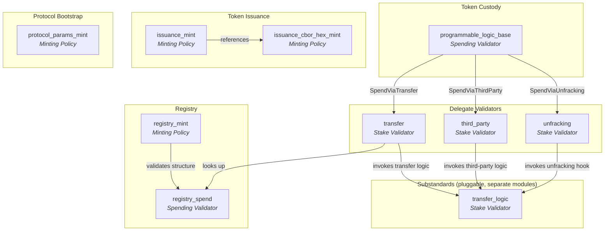
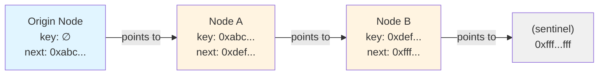
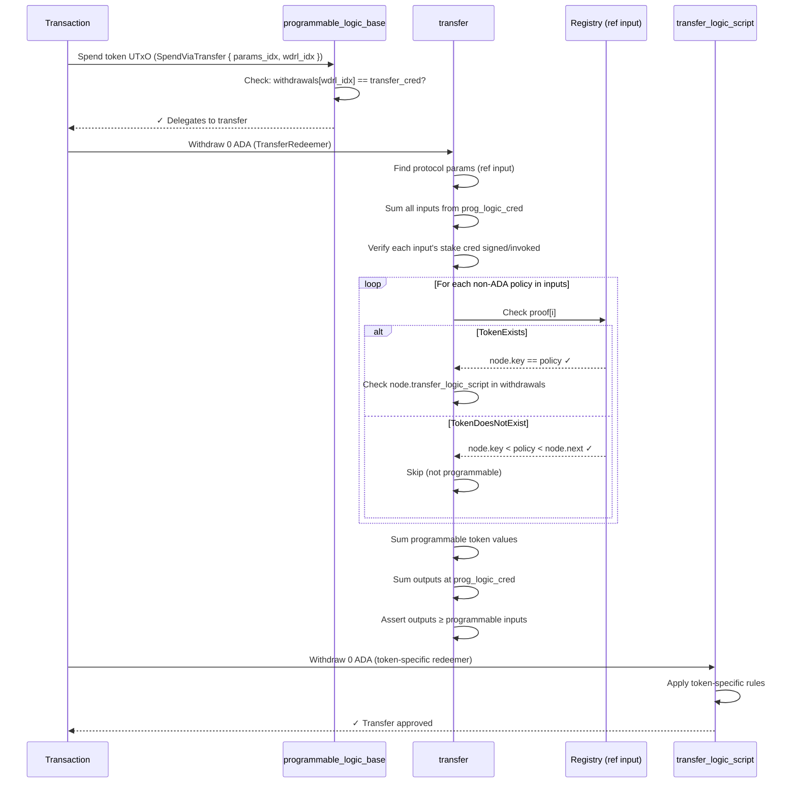

# Architecture Deep-Dive

This document explains the on-chain architecture of the CIP-113 programmable tokens implementation in Aiken. It covers the ownership model, validator coordination, on-chain data structures, and step-by-step validation flows.

---

## Table of Contents

1. [Ownership Model](#ownership-model)
2. [Validator Architecture](#validator-architecture)
3. [Withdraw-Zero Pattern](#withdraw-zero-pattern)
4. [On-Chain Registry](#on-chain-registry)
5. [Denylist System](#denylist-system)
6. [Data Structures](#data-structures)
7. [Validation Flows](#validation-flows)
8. [Security Properties](#security-properties)

---

## Ownership Model

### Shared Payment Credential + Unique Stake Credentials

The fundamental design insight is that Cardano addresses are composed of two parts: a **payment credential** and a **stake credential**. Programmable tokens exploit this by using a single shared payment credential (the `programmable_logic_base` script hash) while assigning unique stake credentials to individual holders.

```
Cardano Address = Payment Credential + Stake Credential
                  ─────────────────   ────────────────
                  Shared across ALL    Unique per holder
                  programmable tokens  (determines ownership)
```

This means:

- **All programmable tokens live at addresses that share the same payment credential** — the `programmable_logic_base` validator hash. This is what enables unified validation: every spend from this payment credential triggers the same spending validator.
- **Ownership is determined by the stake credential** — either a verification key (for wallet holders) or a script hash (for smart contract-controlled holdings).
- **Wallets require integration** — tokens are native assets at the ledger level, but wallets need to resolve stake-credential-based ownership at the shared script address to display balances correctly.

### Transferring Tokens

A transfer changes the stake credential while keeping the payment credential constant:

```
Before:  addr(programmable_logic_base, stake_alice) → 100 USDC
After:   addr(programmable_logic_base, stake_bob)   → 100 USDC
```

The `programmable_logic_base` payment credential is the same in both cases. What changes is who "owns" the UTxO — determined by the stake credential.

---

## Validator Architecture

The system uses a layered architecture where lightweight validators delegate to a central coordinator.



The diagram above shows the **core CIP-113 standard** (Token Custody, Delegate Validators, Registry, Token Issuance, Protocol Bootstrap) and indicates where **substandards** plug in. The core standard is deployed once and shared by all programmable tokens. Substandards are pluggable — different tokens can register different transfer logic and supporting validators depending on their compliance requirements, without modifying the core framework. See the [`substandards/`](https://github.com/cardano-foundation/cip113-programmable-tokens-platform/tree/main/src/substandards) directory for implementations (dummy, freeze-and-seize).

### Validator Reference

**Core Standard (CIP-113 Framework)**

| Validator | Type | Parameters | Purpose |
|-----------|------|------------|---------|
| `programmable_logic_base` | Spend | `params_policy` | Custody of all programmable token UTxOs, and dispatcher. Each spend delegates to exactly one of the three delegate validators — `transfer`, `third_party` or `unfracking` — selected by the redeemer. |
| `transfer` | Stake (withdraw) | `params_policy` | Transfer validator (the hot path). Validates ordinary transfers: checks registry proofs, invokes the policy's transfer logic, enforces value containment. |
| `third_party` | Stake (withdraw) | `params_policy` | Standalone third-party-transfer (seize / clawback / freeze-enforcement) validator. Enforces the custody/conservation invariants and invokes the subject policy's third-party transfer logic. |
| `unfracking` | Stake (withdraw) | `params_policy` | Standalone unfracking validator (Finding 17): holder-driven, same-owner restructuring of PLB UTxOs for one policy; invokes the policy's unfracking hook. |
| `protocol_params_mint` | Mint | `utxo_ref`, `coordination_addr_hash` | One-shot mint of the protocol parameters NFT. |
| `coordination_spend` | Spend | `_nonce` | Guards the coordination UTxO (protocol-params NFT); enforces structural upgrade rails, authorised by the datum's upgrade authority. |
| `upgrade_multisig` | Stake (withdraw) | `signers`, `threshold` | Reference upgrade authority: M-of-N multisig approval for `coordination_spend`'s trampoline. |
| `registry_mint` | Mint | `utxo_ref`, `issuance_cbor_hex_cs`, `registry_spend_cred` | Manages the sorted linked list of registered token policies. |
| `registry_spend` | Spend | `protocol_params_cs` | Guards registry node UTxOs; only allows spending when `registry_mint` is active. |
| `issuance_mint` | Mint | `programmable_logic_base`, `registry_node_cs`, `minting_logic_cred`, `params_policy` | Mints/burns programmable tokens. Parameterized per token type. |
| `issuance_cbor_hex_mint` | Mint | `utxo_ref` | One-shot mint of the reference NFT holding issuance script template bytes. |

Substandard validators (transfer logic, denylist management, etc.) live in the [`substandards/`](https://github.com/cardano-foundation/cip113-programmable-tokens-platform/tree/main/src/substandards) directory as separate Aiken modules.

### Base-to-Delegate Dispatch

The `programmable_logic_base` validator is intentionally minimal — a **dispatcher**. It is parameterized only by the protocol-params NFT policy — its one permanent anchor — and on every spend reads the CURRENT delegate credential out of the coordination datum (located via that NFT among the reference inputs) before verifying that delegate's withdraw-0 is present in the transaction's withdrawals. Its redeemer, `BaseSpendRedeemer`, selects which delegate authorises the spend and witnesses the exact index of that delegate in the (ledger-sorted) withdrawal map:

- `SpendViaTransfer` → delegate to the `transfer` validator (ordinary transfers); PLB requires the `transfer_cred` (params datum field 2).
- `SpendViaThirdParty` → delegate to the `third_party` validator (seize / clawback); PLB requires the `third_party_cred` (params datum field 3).
- `SpendViaUnfracking` → delegate to the `unfracking` validator (same-owner restructuring); PLB requires the `unfracking_cred` (params datum field 4).

No delegate is ever reached through another: each transaction kind loads PLB plus exactly one delegate reference script.

```aiken
// programmable_logic_base.ak — the entire spend logic
validator programmable_logic_base(params_policy: PolicyId) {
  spend(_datum, redeemer: BaseSpendRedeemer, _own_ref, self: Transaction) {
    let fields <- params.with_protocol_params_fields(
      self.reference_inputs,
      params_policy,
      base_params_idx(redeemer),
    )

    // Pick the delegate credential this spend claims, and the withdrawal
    // index that must carry it.
    let (claimed, wdrl_idx) = when redeemer is {
      SpendViaTransfer { wdrl_idx, .. } ->
        (params.transfer_cred_field(fields), wdrl_idx)
      SpendViaThirdParty { wdrl_idx, .. } ->
        (params.third_party_cred_field(fields), wdrl_idx)
      SpendViaUnfracking { wdrl_idx, .. } ->
        (params.unfracking_cred_field(fields), wdrl_idx)
    }

    // Go directly to the witnessed withdrawal entry and require it to
    // carry the claimed delegate credential.
    let Pair(witnessed_cred, _) = list.expect_at(self.withdrawals, wdrl_idx)
    (witnessed_cred == claimed)?
  }
}
```

This pattern is critical for performance: spending validators run once *per input*, but stake validators (via withdrawals) run only once *per transaction*. Since the delegate contains the expensive registry lookups and transfer logic invocations, running it once instead of N times (for N inputs) saves significant execution units. Resolving the delegate by the redeemer-witnessed `wdrl_idx` — a direct `list.expect_at`, which drops `wdrl_idx` list cells (so O(`wdrl_idx`), not O(1)) but performs no credential comparison on the way — rather than scanning the withdrawal map removes one comparison per entry walked, on every input. Measured in `validators/programmable_logic/wdrl_idx_cost.test.ak`: the indexed path grows ~1.1M cpu per position against ~2.7M for the scan, breaks even around position 3, and saves ~19M cpu at width 16 / position 15. A wrong index or arm resolves to a credential that fails the equality, so a dishonest witness only invalidates its own transaction.

**Distinct delegate credentials — an assumption, not an invariant.** The arm of the redeemer is only meaningful while the protocol-params datum carries pairwise-distinct `transfer_cred`, `third_party_cred` and `unfracking_cred`. Neither `protocol_params_mint` (at genesis) nor `coordination_spend` (on upgrades) enforces this; it is a deployment and upgrade-authority responsibility. With two equal credentials both arms resolve to the same script, so either arm is satisfied by that one script's withdrawal and the single delegate must dispatch internally — the pre-split, monolithic shape. Every "wrong arm rejects" statement in these docs, in the property tests, and in any formal statement about PLB dispatch carries this hypothesis (pinned by `plb_equal_delegate_creds_collapse_the_arms` in `programmable_logic_base.test.ak`).

---

## Withdraw-Zero Pattern

The **withdraw-zero pattern** is the mechanism that invokes stake validators without actual staking activity. A transaction includes a withdrawal of 0 ADA from a script's reward address, which forces the ledger to execute that script's `withdraw` handler.

### How It Works

1. The transaction includes `withdrawals: [(script_credential, 0)]`
2. The Cardano ledger sees a withdrawal from a script address and runs the validator
3. The validator's `withdraw` handler executes with access to the full transaction context
4. The 0 ADA withdrawal has no economic effect — it's purely a trigger mechanism

### Why It Matters

This pattern enables three critical capabilities:

1. **Single execution for multiple inputs** — The global validator runs once per transaction, not once per UTxO input. This is essential for multi-input transfers.
2. **Composable validation** — Multiple stake validators can be invoked in the same transaction (global + transfer logic + issuer logic), each checking different aspects.
3. **Pluggable logic** — Transfer logic scripts are registered in the on-chain registry as stake credentials. Any new transfer logic can be deployed without modifying the core validators.

### In Practice

A transfer transaction includes these withdrawals:

```
withdrawals:
  - (transfer,              0 ADA)    # Core transfer validation
  - (transfer_logic_script, 0 ADA)    # Token-specific rules
```

The transfer validator checks that the appropriate transfer logic script is also in the withdrawal list (i.e., it has been invoked). This creates a chain of validation: base → transfer → transfer logic. A seize transaction carries `third_party` + the policy's third-party logic instead; an unfracking transaction carries `unfracking` + the policy's unfracking hook.

---

## On-Chain Registry

The registry is a **sorted linked list** of registered programmable token policies, stored as UTxOs on-chain. Each node is a UTxO containing an NFT marker and an inline datum.

### Structure



Each node is a UTxO with:
- **An NFT** from `registry_mint` policy (token name = `key`, or empty string for origin)
- **An inline datum** of type `RegistryNode` containing the policy key, next pointer, and script references

### O(1) Membership Proofs

The sorted linked list enables constant-time membership and non-membership proofs:

**Token exists** (`TokenExists { node_idx }`): The proof points to a registry node where `node.key == token_policy_id`. The validator checks:
1. The node has an authentic NFT from `registry_node_cs`
2. `node.key == currency_symbol`
3. `node.transfer_logic_script` is in the transaction's withdrawals

**Token does not exist** (`TokenDoesNotExist { node_idx }`): The proof points to a "covering node" where `node.key < token_policy_id < node.next`. Since the list is sorted and complete, this proves no node with that key exists.

```
Covering node proof:

  node.key = 0xabc...    (less than target)
  target   = 0xbcd...    (the policy we're looking up)
  node.next = 0xdef...   (greater than target)

  → 0xbcd... is NOT in the registry
```

This is how the global validator handles non-programmable tokens in the same transaction — it doesn't reject them; it simply skips validation for tokens proven not to be in the registry.

### Insertion

Inserting a new token into the registry (`RegistryInsert`):

1. Find the covering node where `covering.key < new_key < covering.next`
2. Spend the covering node UTxO
3. Create two output UTxOs:
   - **Updated covering node**: `key` unchanged, `next` → `new_key`
   - **New node**: `key` = `new_key`, `next` = old `covering.next`
4. Mint one NFT with token name = `new_key`
5. Validate that `new_key` is a legitimate programmable token (via `IssuanceCborHex` template matching)

```
Before:  [covering: key=A, next=C]
After:   [covering: key=A, next=B]  [new: key=B, next=C]
```

### Registration Contention (a linked-list limitation)

Insertion **spends the covering node** (step 2) and re-creates it at a new
output reference. The in-place node-update path does the same. This is intrinsic
to a linked list — adding or changing a node re-points its predecessor — and it
has a concurrency consequence worth understanding.

Membership and non-membership proofs reference a registry node as a **reference
input**, and a reference input must be a *live* UTxO at validation time. So when
one transaction consumes node *N* (to insert after it, or to update it), any
**other** transaction that referenced *N* by its now-spent output reference
becomes invalid and must be rebuilt against *N*'s new UTxO. Concretely, a
transfer of a token whose proof points at *N* — either a `TokenExists` proof for
*N* itself, or a `TokenDoesNotExist` covering proof that uses *N* — races a
registration/update that touches *N*.

Consequences:

- **User experience.** A transfer (or lookup) that races a registration touching
  its referenced node can fail and needs to be rebuilt and resubmitted against
  the updated node. Registrations are infrequent and the contention is limited to
  transactions referencing the *specific* node(s) being touched, but builders
  must handle the retry (see [`08-INTEGRATION-GUIDES.md`](./08-INTEGRATION-GUIDES.md)).
- **Griefing / DoS.** An actor who repeatedly registers around — or otherwise
  spends — a particular node can transiently block transactions that depend on
  it. The impact is protocol-specific and matters most for time-sensitive flows
  (auctions, liquidations); it is not a custody or escape risk.

This is an accepted, **Informational** limitation of the on-chain linked-list
design. Heavier remediations exist — a parallel array/Merkle-tree registry that
proves membership without consuming a node, or further register/mint separation
— but they add redundancy, cost, and complexity disproportionate to the impact,
so they are deliberately not adopted. The mitigation is **off-chain**: resolve
the covering node at build time and, on failure, re-resolve against the current
registry and rebuild (see [`08-INTEGRATION-GUIDES.md`](./08-INTEGRATION-GUIDES.md)),
and avoid making a single contended node a hard dependency for time-critical
operations.

---

## Denylist System

> **Note:** The denylist is part of the [freeze-and-seize substandard](https://github.com/cardano-foundation/cip113-programmable-tokens-platform/tree/main/src/substandards/freeze-and-seize), not the core CIP-113 framework. It is documented here because it illustrates how substandards extend the core architecture.

The denylist uses the same sorted linked list pattern as the registry, but for credential hashes instead of policy IDs.

### Structure

Each `BlacklistNode` contains:
- `key`: The denylisted credential hash (28 bytes)
- `next`: The next credential hash in sorted order

### Operations

| Operation | Description | Authorization |
|-----------|-------------|--------------|
| `BlacklistInit` | Create origin node | One-shot (UTxO consumed) |
| `BlacklistInsert` | Add credential to denylist | Manager signature required |
| `BlacklistRemove` | Remove credential from denylist | Manager signature required |

### Non-Membership Proofs in Transfers

During a transfer, the `freeze_and_seize_transfer` validator:

1. Extracts all stake credential hashes from programmable token inputs
2. For each credential, requires a `NonmembershipProof { node_idx }` pointing to a covering node
3. Validates `node.key < credential_hash < node.next` for each proof
4. If any credential IS denylisted (no valid covering node exists), the transaction fails

This means every transfer of a denylist-protected token requires O(n) proofs where n is the number of unique stake credentials in the transaction inputs — but each individual proof is O(1).

---

## Data Structures

### RegistryNode

```aiken
type RegistryNode {
  key: ByteArray,                              // Policy ID of the registered token
  next: ByteArray,                             // Next key in sorted order
  minting_logic_script: Credential,            // Stake validator for issuance / registration authority
  transfer_logic_script: Credential,           // Stake validator for transfer rules
  third_party_transfer_logic_script: Credential, // Stake validator for seizure/freeze
  global_state_cs: ByteArray,                  // Optional NFT for global state (e.g., denylist)
  protected_prefixes: List<ByteArray>,         // Append-only CIP-67 label prefixes the third-party path may not seize/burn
}
```

`protected_prefixes` is an issuer-declared, append-only list of 4-byte CIP-67
asset-name label prefixes (kept in strictly ascending order) that the admin path
cannot extract or burn — see
[`03-CONTROL-SCOPE-AND-ADMIN-AUTHORITY.md`](./03-CONTROL-SCOPE-AND-ADMIN-AUTHORITY.md) §2.2.

### BlacklistNode (freeze-and-seize substandard)

```aiken
type BlacklistNode {
  key: ByteArray,   // Denylisted credential hash
  next: ByteArray,  // Next key in sorted order
}
```

### ProgrammableLogicGlobalParams

Stored on-chain in the coordination UTxO, marked by the protocol params NFT:

```aiken
type ProgrammableLogicGlobalParams {
  registry_node_cs: PolicyId,   // 0 — currency symbol of registry NFTs
  prog_logic_cred: Credential,  // 1 — shared payment credential all programmable-token UTxOs live at
  transfer_cred: Credential,    // 2 — LIVE credential of the transfer validator; read by PLB on SpendViaTransfer; rewriting it is an in-place upgrade
  third_party_cred: Credential, // 3 — LIVE credential of the third_party validator; read by PLB on SpendViaThirdParty
  unfracking_cred: Credential,  // 4 — LIVE credential of the unfracking validator (Finding 17); read by PLB on SpendViaUnfracking
  upgrade_cred: Credential,     // 5 — upgrade-authority withdraw-0 credential (coordination_spend's trampoline)
}
```

### Redeemers

**Transfer validator** (`TransferRedeemer`):

Every delegate redeemer carries `params_idx` — the index of the protocol-params
NFT UTxO in `reference_inputs`. The validator addresses that reference input
directly (`list.at`) and authenticates it by the one-shot params NFT, rather
than scanning the reference-input set. The index is a position into the
ledger's canonical `reference_inputs` ordering (see [Reference inputs and
redeemer indices](./09-DEVELOPING-SUBSTANDARDS.md#reference-inputs-and-redeemer-indices)).

```aiken
type TransferRedeemer {
  params_idx: Int,
  // One proof per non-ADA policy in the inputs, in ascending policy order
  proofs: List<RegistryProof>,
}
```

**Base spend validator** (`BaseSpendRedeemer`):

Each programmable-token spend selects one of three delegates and witnesses where
that delegate's credential sits in the (ledger-ordered) withdrawal map. `params_idx`
is the protocol-params NFT's index in `reference_inputs`; `wdrl_idx` is the
delegate credential's index in `withdrawals`.

```aiken
type BaseSpendRedeemer {
  // Delegate to the transfer validator. PLB requires the transfer_cred
  // (params datum field 2) at wdrl_idx.
  SpendViaTransfer { params_idx: Int, wdrl_idx: Int }
  // Delegate to the third_party (seize / clawback) validator. PLB requires
  // the third_party_cred (params datum field 3) at wdrl_idx.
  SpendViaThirdParty { params_idx: Int, wdrl_idx: Int }
  // Delegate to the unfracking validator (Finding 17: a holder redistributes
  // the programmable tokens they already hold across their own PLB UTxOs,
  // value-preserving, same-owner, without any substandard transfer logic).
  // PLB requires the unfracking_cred (params datum field 4) at wdrl_idx.
  SpendViaUnfracking { params_idx: Int, wdrl_idx: Int }
}
```

**Third-party validator** (`ThirdPartyRedeemer`):

The administrative / compliance action — forced transfer, seizure, freeze
enforcement, burn (see [`03-CONTROL-SCOPE-AND-ADMIN-AUTHORITY.md`](./03-CONTROL-SCOPE-AND-ADMIN-AUTHORITY.md)).
Exactly one policy per transaction; acts on every PLB input holding the subject
policy; paired continuing outputs begin at `outputs_start_idx`.

```aiken
type ThirdPartyRedeemer {
  params_idx: Int,        // The protocol-params NFT UTxO in reference inputs
  registry_node_idx: Int, // The subject policy's registry node (one policy per tx)
  outputs_start_idx: Int,
}
```

**Registry proofs** (`RegistryProof`):

```aiken
type RegistryProof {
  TokenExists { node_idx: Int }        // Points to the matching registry node
  TokenDoesNotExist { node_idx: Int }  // Points to the covering node
}
```

**Denylist proofs** (`BlacklistProof`, freeze-and-seize substandard):

```aiken
type BlacklistProof {
  NonmembershipProof { node_idx: Int } // Points to the covering node
}
```

### IssuanceCborHex

Used during registration to verify that a policy ID was generated from the correct issuance script template:

```aiken
type IssuanceCborHex {
  prefix_cbor_hex: ByteArray,   // Prefix of the minting policy script
  postfix_cbor_hex: ByteArray,  // Postfix of the minting policy script
}
```

The registration validator reconstructs the script as `version_header ++ prefix ++ hashed_param ++ postfix`, hashes it with blake2b_224, and checks the result matches the policy ID being registered.

---

## Validation Flows

### Transfer Flow (Step by Step)



Key invariant: the total programmable token value in outputs at the `prog_logic_cred` address must be **at least** the total programmable token value from signed inputs. This prevents tokens from "escaping" the programmable logic address.

### Third-Party (Administrative) Flow

Administrative / compliance operations — forced transfer, seizure, freeze enforcement, or burn — run through the standalone `third_party` validator. A programmable-token spend selects this path with a `SpendViaThirdParty` base redeemer (so PLB requires the `third_party` validator's withdraw-0 instead of the transfer validator's), and the `third_party` validator's withdraw-0 carries a `ThirdPartyRedeemer`. It differs from transfers:

1. **No ownership check** — the `third_party_transfer_logic_script` authorizes the action instead of the stake credential owner
2. **Amount redistribution** — a third-party action is a forced transfer: the subject policy's non-protected tokens on each paired output may be decreased, fully removed, increased, or left unchanged. Aggregate conservation (below) keeps the *total* non-protected subject amount across all PLB outputs accounting for every seized input plus any mint/burn — tokens are redistributed within the PLB, never created from nothing or made to escape
3. **Per-pair mapping** — each spent PLB input is paired positionally with a continuing output (the first pair starts at `outputs_start_idx`); the action covers every PLB input that holds the subject policy
4. **Preservation** — the paired output must preserve the holder's address, datum, **and reference script**, changing only the subject policy's non-protected tokens; all non-subject tokens are conserved byte-for-byte
5. **Anti-injection / anti-DoS** — the paired input must already hold the subject policy, so the admin can neither inject the policy onto a UTxO that never held it nor drag an unrelated UTxO into the action
6. **Protected prefixes** — tokens whose CIP-67 label prefix is on the node's `protected_prefixes` list cannot be extracted or burned ("preserve, not fail")
7. **One policy per transaction** — a `ThirdPartyRedeemer` targets exactly one registry node (see scope note below)

Splitting the seize logic into its own script keeps it off the transfer reference-script hot path: a seize transaction loads `third_party` instead of `transfer`. Measured reference-script footprint drops accordingly — a transfer tx from 3659 B to 3045 B, a seize tx from 3659 B to 2674 B, and (with unfracking dispatched the same way) an unfracking tx from 5491 B to 2700 B.

> **Scope & limits.** The full extraction scope — protected prefixes, the
> freeze-vs-extract asymmetry, who is seizable (holder scope), and the
> single-policy-per-transaction constraint — is specified in
> [`03-CONTROL-SCOPE-AND-ADMIN-AUTHORITY.md`](./03-CONTROL-SCOPE-AND-ADMIN-AUTHORITY.md).

### Token Registration Flow

1. Build a transaction that mints tokens with the new policy **and** inserts a registry node
2. The `registry_mint` validator:
   - Finds the `IssuanceCborHex` reference input (template bytes)
   - Verifies `blake2b_224(version_header ++ prefix ++ hashed_param ++ postfix) == new_policy_id`
   - Verifies the covering node covers the insertion point
   - Validates the two output nodes maintain sorted order
3. The `registry_spend` validator allows spending the covering node because `registry_mint` is active

---

## Security Properties

### NFT Authenticity
Every registry and denylist node is marked with an NFT from a one-shot minting policy. Validators always check `has_currency_symbol(node.value, expected_cs)` before trusting any datum. This prevents forged registry entries.

### Ownership Enforcement
The global validator iterates over **all** inputs from `prog_logic_cred` and requires each one to be authorized by its stake credential (signature for verification keys, withdrawal invocation for scripts). If any input lacks authorization, the entire transaction fails.

### Value Preservation
During transfers, the global validator computes the total programmable token value from authorized inputs and verifies that outputs at `prog_logic_cred` contain **at least** that much value. Tokens cannot be moved to non-programmable addresses.

### Sorted List Integrity
Both registry and denylist maintain the invariant `node.key < node.next` for every node. Insertions verify the covering node covers the new key. This prevents duplicate entries and ensures covering-node proofs are always valid.

### One-Shot Policies
Protocol parameters, registry, denylist, and issuance CBOR hex NFTs use one-shot minting policies (parameterized by a UTxO reference). This guarantees exactly one instance of each can exist, preventing duplication attacks.

### Lifecycle / Issuance Separation
A registry node is spent only by `registry_spend`, which forbids minting or burning that node's own programmable token (`key`) in the same transaction. This holds on both spend paths — an in-place node update and the covering-node spend of an insert (`registry_spend` is the sole spender of every registry-node UTxO). A registry lifecycle operation therefore can never double as an issuance of the same policy: the two are always separate, independently authorized transactions. Note the authorizing credential (`minting_logic_script`) is *shared* between issuance and lifecycle, so a substandard that needs distinct authorities must separate them in its own issuance logic — see [`03-CONTROL-SCOPE-AND-ADMIN-AUTHORITY.md`](./03-CONTROL-SCOPE-AND-ADMIN-AUTHORITY.md) §3.2.

---

**Next**: [Developing Substandards](./09-DEVELOPING-SUBSTANDARDS.md) for a guide on implementing custom substandards | **Back to**: [README](../README.md) | [Introduction](./01-INTRODUCTION.md)
